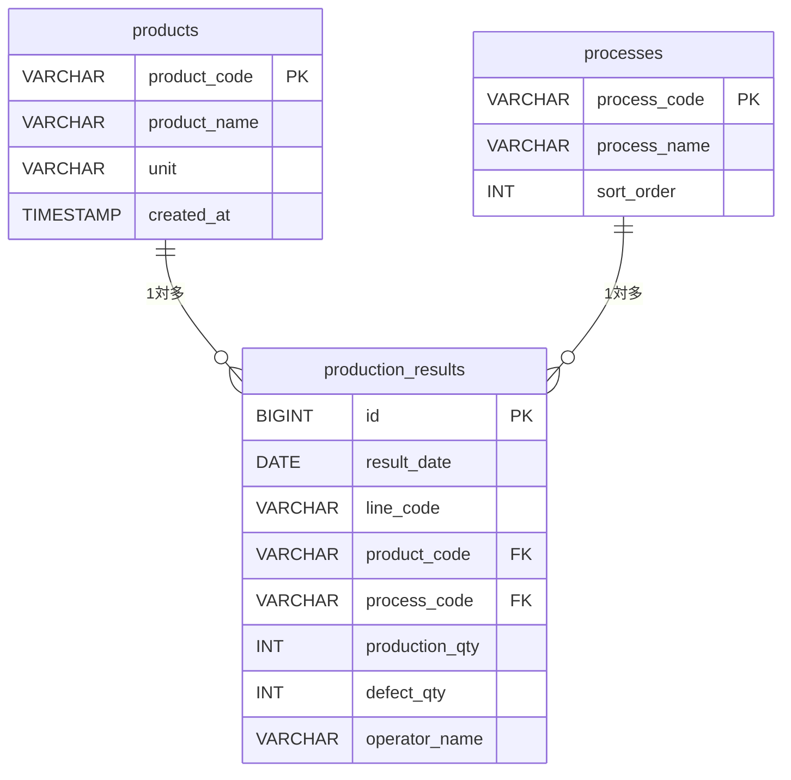

# ER 図 - 03_factory-crud

```mermaid
erDiagram
    products {
        VARCHAR product_code PK
        VARCHAR product_name
        VARCHAR unit
        TIMESTAMP created_at
    }

    processes {
        VARCHAR process_code PK
        VARCHAR process_name
        INT sort_order
    }

    production_results {
        BIGINT id PK
        DATE result_date
        VARCHAR line_code
        VARCHAR product_code FK
        VARCHAR process_code FK
        INT production_qty
        INT defect_qty
        VARCHAR operator_name
    }

    products ||--o{ production_results : "1対多"
    processes ||--o{ production_results : "1対多"
```

## テーブルの関係

- `products`（製品マスタ）→ 1件の製品に対して生産実績が複数ある
- `processes`（工程マスタ）→ 1件の工程に対して生産実績が複数ある
- `production_results`（生産実績）→ 製品・工程を外部キーで参照
